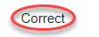

== Guideline template

Guidelines are documented by using a standard template. Use of this template is recommended when creating original quidelines.

NOTE: This template specifies the minimum requirements that are needed to understand a guideline.
New items can be added to the template as long as they do not duplicate existing information.

[cols="<1,<1,<3,<2"]
|===
2+s|Rule ID: Title
2+|xx_nnnn: Title of the guideline (unique, short)
2+s|Sub ID Recommendations
2+|NA-MAAB: x, y, z

JMAAB: X, Y, z
2+s|version
2+|all

Rx, Ry, Rz

Rx and earlier
4+s|Rule (This is a rule title)

s|Sub ID
2+s|Description
s|Custom Parameter
.3+|xn
2+|(Description of the guideline)
|(Parameter Name)
3+a|[Correct] (Correct image and comment in description)

Correct image
3+|[incorrect] (Error image and comment in description)

4+s|Rationale
s|Sub ID
3+s|Description
|xn
3+|(Rationale)

4+s|See Also
4+a|* XYZ
|===
